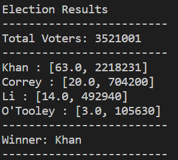

# Python Scripts

## Financial Analysis
Python scripts created to analyze the financial records sourced in a .csv file.  The dataset is composed of two columns: Date and Profit/Losses. 

CALCULATIONS:

1.  The total number of months included in the dataset
2.  The net total amount of "Profit/Losses" over the entire period
3.  The average of the changes in "Profit/Losses" over the entire period
4.  The greatest increase in profits (date and amount) over the entire period
5.  The greatest decrease in losses (date and amount) over the entire period

OUTPUT:

 

## Election Results

Python scripts written to analyze and calculate election results composed of three columns: Voter ID, County, and Candidate. 

CALCULATIONS:

1.  The total number of votes cast
2.  A complete list of candidates who received votes
3.  The percentage of votes each candidate won
4.  The total number of votes each candidate won
5.  The winner of the election based on popular vote

OUTPUT:

